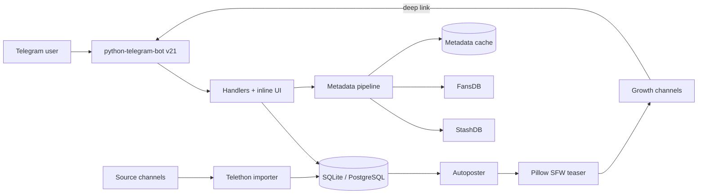

<p align="center">
  
</p>

<h1 align="center">NoDick</h1>

<p align="center">
  <strong>A fast, private and dangerously polished adult media discovery bot for Telegram.</strong>
</p>

<p align="center">
  Instant streaming · intelligent metadata · silent channel indexing · built-in growth loops
</p>

<p align="center">
  <a href="https://t.me/Moyechan_bot"></a>
  <a href="#-quick-start"></a>
</p>

<p align="center">
  
  
  
  
  
  
</p>

> [!IMPORTANT]
> **Adults only.** This project indexes media you already control or are authorized to access. Operators are responsible for consent, copyright, Telegram policy and local law.

---

## 🖤 Not another file-forwarding bot

NoDick turns a Telegram channel into a searchable, enriched streaming library. It silently indexes videos, cleans chaotic filenames, matches scenes against metadata providers and delivers everything through a compact inline-button interface.

No browser pop-ups. No clumsy message dumps. No archaeological expedition through twelve thousand channel posts.

<table>
<tr>
<td width="33%" valign="top">

### ⚡ Instant discovery

Search, categories, performers, recommendations, random picks and favorites—all inside Telegram.

</td>
<td width="33%" valign="top">

### 🧠 Smart metadata

StashDB/FansDB enrichment, fuzzy title matching, phonetic performer matching and confidence controls.

</td>
<td width="33%" valign="top">

### 📈 Growth built in

Autopost teasers, referrals, streaks, Premium milestones, viral video links and welcome A/B tests.

</td>
</tr>
</table>

---

## ✨ The experience

```text
Channel library
      │
      ▼
Silent Telethon scan ──► title cleanup ──► metadata matching
                                              │
                                              ▼
Telegram UI ◄── search / random / cast / similar / categories
      │
      ├──► favorites + watch streaks
      ├──► share exact video with referral attribution
      └──► blurred channel teasers bring the next user in
```

### Discovery

- **🎲 Surprise Me** — one-tap random playback with quota visibility.
- **🔍 Search** — clean title search across the indexed library.
- **📁 Categories** — browse organized studios and content groups.
- **🎭 Performer discovery** — search performers and open cached filmographies.
- **🎯 More Like This** — recommendations powered by cached cast and tags.
- **⭐ Favorites** — personal saves without polluting the source channel.
- **🧩 Multipart navigation** — correctly ordered previous/next controls.

### Intelligence

- **StashDB + FansDB GraphQL** metadata enrichment.
- **RapidFuzz** similarity scoring and **Jellyfish** phonetic matching.
- Configurable match threshold from permissive to perfectionist.
- Cache-first captions for fast repeat views and fewer API calls.
- Corrected titles, performers and studios take priority over external metadata.
- Graceful local-title fallback when metadata services are unavailable.

### Growth engine

- **🚀 Multi-channel autoposter** with cooldowns and repeat avoidance.
- **🫥 SFW teaser generation** using heavily blurred source artwork or thumbnails.
- **🎁 Invite & Earn** with configurable watch bonuses.
- **👑 Premium milestones** — every ten successful referrals grants 30 days.
- **🔥 Watch streaks** with escalating daily quota bonuses.
- **📤 Viral video sharing** — shared links open the exact video and attribute new users.
- **🧪 Welcome A/B tests** measuring real exposure-to-first-watch conversion.
- **📊 Referral social proof** with daily activity and anonymized leaderboard pressure.

### Operations

- SQLite locally; PostgreSQL in production.
- Docker and Render-ready deployment.
- Runtime admin settings stored in the database.
- Configurable force-join channels, auto-delete timers, ads, payment copy and QR.
- Restart, uptime, new-user, referral and Premium event logging.
- Flood-control retries for Telegram channel copies.

---

## 🎮 Commands

### Everyone

| Command | What it does |
|---|---|
| `/start` | Open the main interface |
| `/random` | Play a surprise video |
| `/search <query>` | Search the indexed library |
| `/categories` | Browse by category |
| `/favorites` | Open saved videos |
| `/performer <name>` | Find a performer |
| `/mystats` | View quota, referrals and streak |
| `/refer` | Open the referral dashboard |
| `/premium` | View Premium access |

### Admin

| Command | What it does |
|---|---|
| `/stats` | Library, user and A/B conversion analytics |
| `/settings` | Inline administration dashboard |
| `/import_scan <channel> <message_id>` | Silent bot-token channel scan |
| `/import <channel>` | Full Telethon session import |
| `/import_status` | Current import progress |
| `/threshold <0-100>` | Metadata confidence threshold |
| `/broadcast <message>` | Send an announcement to users |

Most recurring configuration lives in the inline **⚙️ Settings** dashboard. Slash-command archaeology is kept to a minimum because this is software, not a ritual.

---

## 🧬 Architecture



<details>
<summary><strong>Repository map</strong></summary>

```text
NoDick/
├── nodick/
│   ├── __main__.py              # CLI entry point
│   ├── config.py                # Environment-backed settings
│   ├── db.py                    # SQLite/PostgreSQL schema + data layer
│   ├── utils.py                 # Titles, categories and formatting
│   ├── telegram/
│   │   ├── app.py               # Commands, callbacks and jobs
│   │   └── keyboards.py         # Inline interface layouts
│   ├── metadata/
│   │   ├── stash.py             # StashDB/FansDB GraphQL
│   │   ├── matching.py          # Fuzzy + phonetic matching
│   │   ├── performer_db.py      # Performer cache
│   │   └── rename.py            # Rename suggestions
│   ├── services/
│   │   ├── importer.py          # Full Telethon history import
│   │   ├── message_importer.py  # Silent bot-token scanner
│   │   ├── poster.py            # Blurred teaser autoposter
│   │   └── session.py           # Telegram session login
│   ├── backfill_metadata.py
│   └── backfill_sizes.py
├── Dockerfile
├── render.yaml
└── requirements.txt
```

</details>

---

## 🚀 Quick start

### Requirements

- Python **3.10+**
- A Telegram bot token from [@BotFather](https://t.me/BotFather)
- Telegram API credentials from [my.telegram.org](https://my.telegram.org) for full-history imports
- Optional StashDB/FansDB credentials for enriched metadata

### Install

```bash
git clone https://github.com/Therazerhub/NoDick.git
cd NoDick

python3 -m venv .venv
source .venv/bin/activate
pip install -r requirements.txt

cp .env.example .env
python -m nodick init-db
python -m nodick run
```

### Minimum configuration

```dotenv
BOT_TOKEN=your_bot_token
ADMIN_ID=your_telegram_user_id
DB_PATH=runtime/nodick.db
```

For a production database, set `DATABASE_URL` to a PostgreSQL connection string in your deployment dashboard. **Never commit tokens, database credentials or `.env` files.**

<details>
<summary><strong>Optional integrations</strong></summary>

```dotenv
# Full channel-history imports
TELEGRAM_API_ID=123456
TELEGRAM_API_HASH=your_api_hash
TELEGRAM_PHONE=+10000000000
TELEGRAM_USER_SESSION=runtime/nodick_user
IMPORT_CHANNEL_ID=-1001234567890

# Metadata
STASHDB_API_KEY=your_stashdb_api_key
STASHDB_GRAPHQL_URL=https://stashdb.org/graphql
FANSDB_API_KEY=
FANSDB_GRAPHQL_URL=https://fansdb.cc/graphql

# Matching and diagnostics
MATCH_THRESHOLD=0.80
AUTO_RENAME_THRESHOLD=0.90
DEBUG_MATCHING=false
LOG_LEVEL=INFO
LOGS_CHANNEL_ID=0
```

</details>

---

## 📥 Importing a library

### Silent bot-token scan

Forward the latest source-channel video to the bot once, then use the **🛰 Import** button. The stored channel and resume position make future scans one tap.

Power-user equivalent:

```text
/import_scan -1001234567890 10542
```

### Full Telethon history

```bash
python -m nodick session-login
python -m nodick import -1001234567890
```

The in-bot `/import` command is also available after the session has been configured.

---

## 🌐 Metadata matching

```text
/threshold 0     → accept everything
/threshold 80    → strong matches only
/threshold 100   → exacting, merciless perfection
```

Without an API key, playback and local title parsing continue to work. Metadata enhancement is optional; the bot does not collapse dramatically onto a velvet chaise longue when StashDB is unavailable.

---

## 🐳 Docker

```bash
docker build -t nodick .
docker run --env-file .env -p 10000:10000 nodick
```

The container starts the Telegram bot and exposes its health server through the platform-provided `PORT` value.

---

## 🔐 Security

- Keep `BOT_TOKEN`, API keys, session files and database URLs out of Git.
- Configure production secrets through the Render dashboard or your hosting platform.
- Restrict bot administration to the configured owner and explicitly granted admins.
- Use only channels and media you are authorized to index.
- Rotate credentials immediately if they are ever exposed.

---

## 🛠 Built with

<p align="center">
  <a href="https://python.org">Python</a> ·
  <a href="https://python-telegram-bot.org">python-telegram-bot</a> ·
  <a href="https://telethon.dev">Telethon</a> ·
  <a href="https://stashdb.org">StashDB</a> ·
  <a href="https://www.postgresql.org">PostgreSQL</a> ·
  <a href="https://pillow.readthedocs.io">Pillow</a> ·
  <a href="https://render.com">Render</a>
</p>

---

<p align="center">
  <strong>Designed and engineered by <a href="https://github.com/Therazerhub">Razer</a>.</strong>
  <br />
  <sub>Fast when it matters. Polished where everyone else gets lazy.</sub>
</p>
